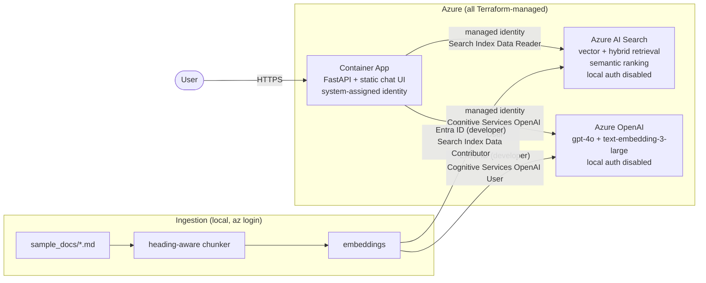

# azure-openai-rag

Chat over your documents, running entirely on Azure: Azure OpenAI + Azure AI Search, deployed with Terraform, authenticated end to end with managed identity and zero stored keys.



## Zero keys, zero secrets

This is the headline feature: **there is no API key anywhere in this project**. Not in code, not in env vars, not in CI, not in Terraform state. Local authentication (API keys) is disabled on both AI services in Terraform (`local_auth_enabled = false` on Azure OpenAI, `local_authentication_enabled = false` on AI Search), so a data-plane key does not even exist to leak.

How every caller authenticates instead:

| Caller | Identity | Roles (Terraform-managed) |
|---|---|---|
| Container App -> Azure OpenAI | System-assigned managed identity | Cognitive Services OpenAI User |
| Container App -> AI Search | System-assigned managed identity | Search Index Data Reader |
| Developer / ingestion -> Azure OpenAI | Your Entra ID user via `az login` | Cognitive Services OpenAI User |
| Developer / ingestion -> AI Search | Your Entra ID user via `az login` | Search Index Data Contributor, Search Service Contributor |

The application code has exactly one auth construct: `DefaultAzureCredential`. In Azure it resolves to the Container App's managed identity; on your laptop it resolves to your `az login` session. The OpenAI client uses `azure_ad_token_provider`, the Search clients take the credential directly. Same code, both places, zero configuration drift.

The env vars the app reads (`AZURE_OPENAI_ENDPOINT`, `AZURE_SEARCH_ENDPOINT`, deployment and index names) are identifiers, not credentials. Knowing them grants nothing without an RBAC role.

## What this demonstrates

- **RAG architecture**: query embedding, retrieval, grounded prompting with inline citations, conversation history handling
- **Hybrid + vector search**: HNSW vector search fused with BM25 keywords in one query, re-ranked by Azure AI Search semantic ranking
- **Secure-by-default Azure auth**: managed identity everywhere, API keys disabled at the resource level, least-privilege RBAC (the app can read the index but never write it)
- **IaC for AI services**: Azure OpenAI model deployments, AI Search, Container Apps, and every role assignment expressed in one Terraform root module
- **Clean Python service design**: retrieval logic isolated in `app/rag.py`, typed models at the API boundary, small pure functions, pinned dependencies, multi-stage non-root Dockerfile

## Repo layout

```
app/                    FastAPI service
  main.py               routes: POST /api/chat, GET /healthz, static UI
  rag.py                retrieval + generation engine (the interesting file)
  config.py             env-driven settings, identifiers only
  static/               vanilla HTML/CSS/JS chat UI with citations
  Dockerfile            multi-stage, non-root
ingestion/
  ingest.py             chunk -> embed -> index, idempotent
sample_docs/            4 Northwind Robotics docs (fictional company)
terraform/              single root module: OpenAI, Search, Container App, RBAC
Makefile                deploy / ingest / run-local / destroy
.github/workflows/      fmt, validate, tflint, checkov, ruff
```

## Getting started

Prerequisites: Terraform >= 1.9, Azure CLI (logged in with `az login`), Python 3.12+, and an Azure subscription with Azure OpenAI access.

```bash
# 1. Provision. You will be asked for your Entra object ID
#    (az ad signed-in-user show --query id -o tsv), or set it in terraform.tfvars.
cp terraform/terraform.tfvars.example terraform/terraform.tfvars
make deploy

# 2. Load endpoints and names into your shell (identifiers only, no secrets).
eval "$(make -s env)"

# 3. Build the index from sample_docs/.
pip install -r app/requirements.txt
make ingest

# 4. Try it locally first...
make run-local            # http://localhost:8000

# 5. ...then ship the real image and point the Container App at it.
make build-image IMAGE=ghcr.io/dannyc96/azure-openai-rag:latest
docker push ghcr.io/dannyc96/azure-openai-rag:latest
terraform -chdir=terraform apply -var container_image=ghcr.io/dannyc96/azure-openai-rag:latest

# Open the app.
terraform -chdir=terraform output -raw app_url
```

Note: the first apply runs a public placeholder image so provisioning never depends on an image you have not built yet. Step 5 swaps in the real app. RBAC role assignments can take a minute or two to propagate after apply; if the first request returns a 502, give it a moment.

Ask it things the sample docs actually answer: "What is the on-call escalation policy?", "What is the NR-340's payload capacity?", "Can I expense alcohol at a client dinner?"

## How retrieval works

**Chunking** (`ingestion/ingest.py`): markdown files are split at h1/h2/h3 headings, because headings are where authors already drew semantic boundaries. Oversized sections are split again on paragraph boundaries with a 200-character overlap carried forward, so sentences near a split remain retrievable from either side. Every chunk keeps its document title and heading, which become the citation labels in the UI.

**Indexing**: each chunk is embedded with `text-embedding-3-large` (3072 dimensions) and stored in an AI Search index with an HNSW vector field plus searchable text fields. Document IDs are deterministic hashes, so re-running ingestion upserts in place; `--recreate-index` rebuilds after schema changes.

**Query time** (`app/rag.py`): the question is embedded, then a single hybrid query runs vector k-NN and BM25 keyword search together, fused with Reciprocal Rank Fusion. The semantic ranker (free tier) then re-orders the fused results, which noticeably helps natural language questions over short policy chunks. The top 4 chunks are numbered into the prompt, and gpt-4o is instructed to answer only from them and cite `[n]` inline. The UI renders those markers as chips and shows the underlying chunks under each answer.

## Cost

Rough monthly figures for this stack left running 24/7 (list prices, region-dependent, verify against the Azure pricing calculator):

| Resource | Tier | Approx. monthly |
|---|---|---|
| Azure AI Search | Basic | ~$75 |
| Azure OpenAI | Pay per token | ~$1-5 at demo usage (gpt-4o + embeddings) |
| Container Apps | Consumption, scale to zero | ~$0-5 |
| Log Analytics | Pay per GB, 30-day retention | ~$0-2 |

AI Search Basic is the dominant cost and bills while provisioned, not per query. **`make destroy` returns this to $0.** Spin it up for a demo, tear it down after.

## Part of a portfolio

This repo is one of three:

- [azure-landing-zone](https://github.com/dannyc96/azure-landing-zone): subscription scaffolding, networking, and policy foundations
- [azure-observability-stack](https://github.com/dannyc96/azure-observability-stack): the full monitoring story (this repo intentionally keeps only a minimal Log Analytics workspace, dashboards and alerting live there)
- azure-openai-rag (this repo): AI workload built on those foundations

## License

MIT, see [LICENSE](LICENSE).
